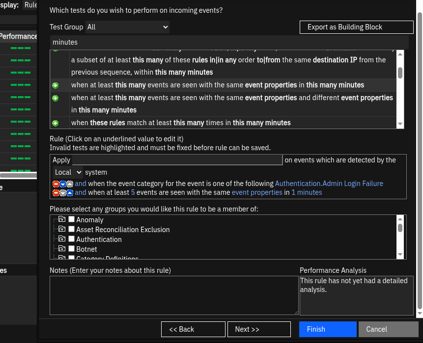
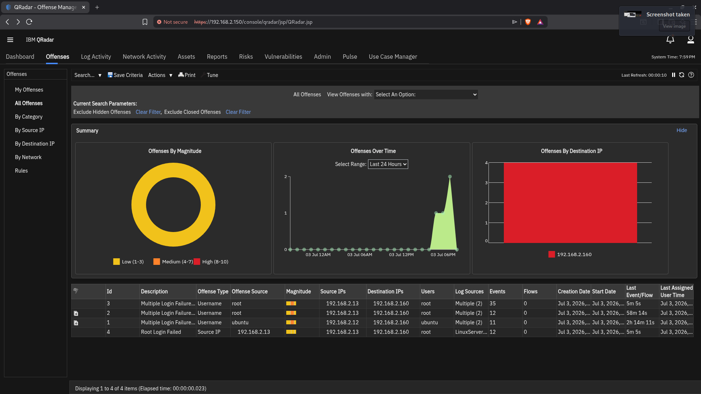
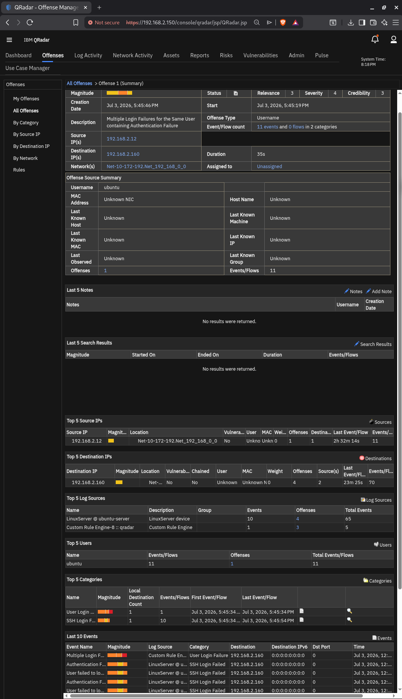

# QRadar Lab: Detecting SSH Brute Force Attacks

Hey everyone! Today I built a home lab to simulate and detect an SSH Brute Force attack using IBM QRadar. 

## The Setup
* **Attacker:** Kali Linux
* **Target:** Ubuntu Server
* **SIEM:** IBM QRadar

---

## Step 1: Making the Rule
I created a custom rule in QRadar. The logic is simple: 
If someone tries to log in and fails (`Authentication.Admin Login Failure`) **5 times** from the **same Source IP** within **1 minute**, QRadar triggers an alert.
**MITRE ATT&CK:** T1110 – Brute Force

Custom correlation rule
---

## Step 2: The Attack & The Offense
I went to my Kali Linux machine and ran a quick brute force attack against the Ubuntu Server using wrong passwords. 

Immediately, QRadar caught it! It didn't open 11 different alerts. Instead, it combined everything into **one clean Offense** because the traffic came from the same Kali IP.

Offense created after 5 failed logins
---

## Step 3: SOC Analyst Investigation
When you double-click the Offense, you open the **Incident View** (Offense Summary Page). 

As a SOC Analyst, I can see all the evidence in one place:
* Who is attacking (Source IP)
* Who is the target (Destination IP)
* What username they tried to guess (`ubuntu`)
* The exact log events at the bottom

Offense investigation view
---

This was an awesome hands-on project to practice real-time log analysis and SIEM correlation!

## What I learned
- How QRadar correlates many failed login events into **one Offense** instead of flooding the analyst with separate alerts.
- Correlation rules reduce alert noise in a real SOC workflow.
